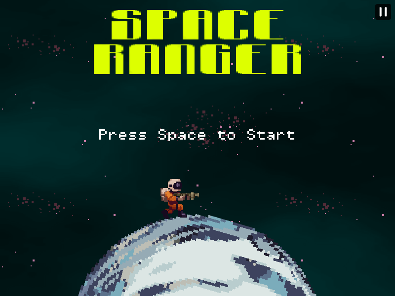

<div align="center">

# [Space Ranger](https://github.com/buneeIsSlo/Space-Ranger)

A 2D space adventure game made with Kaboom.js



</div>

## 🧰Tech used

- HTML
- CSS
- JavaScript
- [Kaboom.js](https://kaboomjs.com/)
- [Vite](https://vitejs.dev/)

## 💻 Setup Locally

Clone the project

```bash
  git clone https://github.com/buneeIsSlo/Space-Ranger
```

Go to the project directory

```bash
  cd Space-Ranger
```

Install dependencies

```bash
  npm install
```

Start the development server

```bash
  npm run dev
```

Build and compile

```bash
  npm run build
```

## 🛣 Roadmap

- [ ] Add more levels

- [ ] Add ability to mute/pay background music

- [ ] Improve player movement and hit box

## 🌈 Inspiration

The inspiration for creating this game comes from my love for classic platformers like Mario and RPGs like Pokémon, which have been a source of joy and fun for me throughout my life. I've always found the idea of exploring vast worlds and discovering new creatures and power-ups to be incredibly thrilling. So when I stumbled upon the Kaboom.js library, I was immediately hooked and knew that I had to create a game using its intuitive and user-friendly features. Although the game currently only has one level, there are plans to add more levels soon, each one more challenging and exciting than the last.

## 💡 Challenges/Learnings

Building this game was a learning experience in more ways than one. For instance, when it came to the assets such as PNGs, sprites, and mp3 files, I found the [opengameart.org](https://opengameart.org/) website where I could download them, which saved me a lot of time and effort. However, designing the levels themselves proved to be a little tricky because I wanted to create levels that were both challenging and interesting to play, without becoming boring or repetitive.

In terms of development, KaboomJS was an excellent resource. Its inbuilt methods and functions made it incredibly easy to implement the game logic, load assets, and debug the game. Despite this, I still encountered some challenges. For example, I had trouble figuring out the right aspect ratio for the game, as well as implementing character movement and applying sprites correctly. I also struggled with adding enemies and making them chase the player, which required me to think creatively and experiment with different approaches.

Another significant challenge was ensuring that the game remained balanced in terms of difficulty. It was important to strike a balance between being too easy and too difficult, which required careful consideration and playtesting. Through these challenges, I learned the importance of patience, perseverance, and experimentation in game development. I also gained valuable experience in coding and design, which will undoubtedly serve me well in future projects.

## 📜 License

[MIT](https://choosealicense.com/licenses/mit/)

## 💙 Acknowledgements

- When I had doubts or questions about the Kaboom.js library or game development in general, the community members(especially MF#8728) at the Kaboom.js [Discord server]() were exceptionally helpful and quick to assist me.

<br>

<div align="center">

<strong>⭐ Leave a star maybe? ⭐</strong><br>

<a href="">Source</a>
| <a href="" target="_blank">Twitter </a>
| <a href="" target="_blank">LinkedIn </a>
| <a href="" target="_blank">Other Projects </a>

</div>
